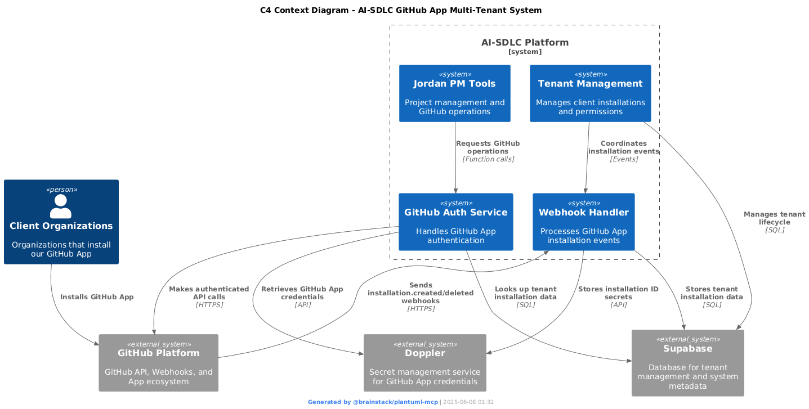

# AI-SDLC GitHub App Multi-Tenant Architecture

## Overview
This document describes the architecture for our multi-tenant GitHub App system that handles installation management and provides GitHub operations for multiple client organizations.

## C4 Context Diagram

## System Components

### External Systems

#### GitHub Platform
- **Purpose**: Source of webhook events and target for API operations
- **Interactions**: 
  - Receives GitHub App installations from client organizations
  - Sends webhook events to our system
  - Processes authenticated API requests from our services

#### Client Organizations  
- **Purpose**: End users who install our GitHub App
- **Interactions**:
  - Install/uninstall GitHub App through GitHub marketplace or direct installation
  - Trigger webhook events when installation state changes

#### Doppler
- **Purpose**: Secure secret management for GitHub App credentials
- **Interactions**:
  - Stores GitHub App ID, private key, client credentials
  - Stores installation IDs per organization
  - Provides secure access to credentials for authentication

#### Supabase
- **Purpose**: Database for tenant management and system metadata
- **Interactions**:
  - Stores installation metadata (permissions, status, timestamps)
  - Manages tenant lifecycle and relationships
  - Provides audit trail for installation events

### AI-SDLC Platform Components

#### Webhook Handler
- **Purpose**: Processes GitHub App installation lifecycle events
- **Technology**: @octokit/webhooks with TypeScript event typing
- **Responsibilities**:
  - Receives installation.created/deleted/suspend/unsuspend events
  - Validates webhook signatures for security
  - Dispatches events to appropriate handlers using event registry pattern
  - Stores installation data in Supabase and Doppler

#### Jordan PM Tools
- **Purpose**: Project management operations requiring GitHub API access
- **Responsibilities**:
  - Creates repositories, issues, projects, milestones
  - Manages GitHub project boards and workflows
  - Requires authenticated GitHub API access per tenant

#### GitHub Auth Service
- **Purpose**: Handles GitHub App authentication for multi-tenant operations
- **Responsibilities**:
  - Generates JWT tokens for GitHub App authentication
  - Retrieves installation-specific access tokens
  - Looks up tenant installation IDs from Doppler
  - Provides authenticated Octokit instances to other services

#### Tenant Management
- **Purpose**: Coordinates tenant lifecycle and permissions
- **Responsibilities**:
  - Manages installation metadata in Supabase
  - Coordinates with webhook handler for installation events
  - Provides tenant context for operations
  - Handles tenant isolation and permissions

## Data Flow

### Installation Flow
1. Client organization installs GitHub App
2. GitHub sends installation.created webhook to Webhook Handler
3. Webhook Handler stores complete installation data in Supabase
4. Installation data includes: installation_id, account info, permissions, timestamps

### Operation Flow
1. Jordan PM Tools requests GitHub operation for specific organization
2. GitHub Auth Service looks up installation_id from Supabase by organization name
3. GitHub Auth Service retrieves GitHub App credentials from Doppler
4. GitHub Auth Service generates authenticated Octokit instance
5. Jordan PM Tools performs GitHub API operation with proper tenant context

## Architecture Decisions

### Why @octokit/webhooks?
- **Proper TypeScript typing** for all GitHub webhook events
- **Event registry pattern** - one handler per event type (SRP)
- **Built-in signature validation** for security
- **Scalable event handling** - add new events incrementally
- **Industry standard** - no reinventing the wheel

### Why Supabase for Tenant Management?
- **Already available** in our infrastructure
- **SQL database** for complex tenant relationships and queries
- **Real-time subscriptions** for event coordination
- **Audit trail** capabilities for compliance
- **No data segregation needed** - internal system management only

### Why Doppler for Secrets?
- **Secure credential storage** with encryption at rest
- **API access** for dynamic secret retrieval
- **Environment separation** (dev/staging/prod)
- **Installation ID storage** per organization
- **Centralized secret management** across services

## Implementation Status

### ✅ Completed
- Architecture design and C4 Context diagram
- Webhook handler implementation using @octokit/webhooks
- Installation event handlers (created/deleted) with Supabase storage
- Professional logging with @brainstack/log
- Comprehensive unit tests with 100% coverage on handlers
- TypeScript compilation and build process
- Supabase integration for installation management
- Helper function for installation ID lookup by organization

### 🔄 In Progress
- Deployment of webhook endpoint to cloud
- End-to-end testing with GitHub App reinstall

### ❌ Pending
- Jordan PM Tools integration with new Supabase lookup
- Installation suspend/unsuspend event handlers
- Production webhook deployment and configuration

## Next Steps

1. **Install Dependencies**: Add @octokit/webhooks and @octokit/webhooks-types
2. **Create Event Handlers**: Implement installation.created and installation.deleted handlers
3. **Design Supabase Schema**: Create tables for tenant installations and metadata
4. **Implement Webhook Endpoint**: Create Next.js API route with proper middleware
5. **Test Integration**: Reinstall GitHub App and verify installation ID storage
6. **Update Jordan's Tools**: Integrate with new multi-tenant auth service

## Future Considerations

- **AI-Powered Knowledge Management**: Epic created for conversational access to architecture decisions
- **Monitoring and Observability**: Add logging and metrics for webhook processing
- **Rate Limiting**: Implement GitHub API rate limiting per tenant
- **Error Handling**: Comprehensive error handling and retry mechanisms
