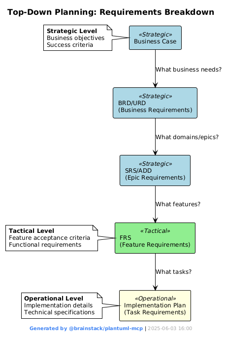

# AI-SDLC Methodology – Human-AI Collaborative Development

## 🎯 Overview

The AI-SDLC (AI-powered Software Development Life Cycle) is a comprehensive methodology that combines human strategic thinking with AI implementation capabilities. This approach ensures high-quality software delivery through structured collaboration between humans and specialized AI agents.

### 🔑 Key Features
- **Human-in-the-loop decision making** at every critical phase
- **Specialized AI agents** for different development roles (Business Analyst, Architect, Developer, etc.)
- **Complete traceability** from business requirements to delivered code
- **Domain-driven vertical development** approach
- **Continuous approval gates** ensuring strategic alignment

### 📋 Methodology Structure
The methodology consists of three main phases:
1. **Strategic Planning** (Phases 1.1-1.4): Foundation and architecture
2. **Iterative Implementation** (Phases 2.1-2.4): Domain-driven development
3. **Integration & Delivery** (Phases 3.1-3.2): Quality assurance and deployment

## 🔷 Phase 1: Strategic Planning (Human-AI Collaboration)

### Phase 1.1 - Business Case Creation
**Participants:** Human + AI Business Analyst  
**Input:** Business problem identification  
**Output:** Business Case document  
**Discussion Topics:** Problem definition, stakeholder identification, success criteria, ROI analysis

  
 
### Phase 1.2 - Requirements Definition
**Participants:** Human + AI Business Analyst  
**Input:** Approved Business Case  
**Output:** BRD (Business Requirements Document) + URD (User Requirements Document)  
**Discussion Topics:** Functional requirements, user stories, business rules, acceptance criteria 

![Phase 1.2 - Requirements Definition](https://www.plantuml.com/plantuml/png/ZLHHRzCm47xFhpW2ZBQYYpOD2KrTjQuLR193LSkUAyUvj6QERMndMmNyTyv9cpOTJFZ5YS_ttNtVdU_IUMPzMSZebL1SbXd2odlZpfF4iiVZfV2hCYqTMgwLH-MFkIuI8vaAFdtdCodIP7pMduQZkzilIS6SHqj7Yx4kZ5R1nmJyo0il4S959TGIfYlc44wEJw4FC_nH2ei5NNOmmLmeuOLMKJH5wxJghCg2gVSGNuSzfe-vjypZKd38a0j7Tw5WzsZ9ziOPApnUnARoZRjR42OMAIFVqGrSbKueT0v6Yicrym6obOCp1Ckag4mDejMfzWGOZKaCHWXsSQLBbJ6xxfX0Pt6oE2Me_w0MT-5d1BGQbJhf9ga53qX2cT8JLfFgc4v3dZV101FDou0PJaR6MFs06MmHe2hMKoltRElGFGYR2STB5oGag4dp4u37MagMQf9QF23CiJ6qI2sPNw4D9Js21z8iOxw-riJcA_OyRcgpHMcpG74sIUvcam2yfUNYVUf7S4STs9Bo7zH-Hz4xg1No6dRKeXdAlmlSed-ZScsBTl2jbjq0FHVqGD8rkB0_Zx3fqnRcbDwNuC9GlxgQOa6j0_X4_Ua5rRHRkMwwyqNNbkmeoUHhhQlSThK3weUivEZeTKWgdMMfn2hAFlok0DFDzMSnigOS545fZs35SkL1v_lC0NgzlU3Vj17SdVTwPEZ3frBna2EJOFUWArjLLUUr5HYAx3WgPeMkZKq1R2ahiz61CTRMhrhrynUWHvoZyKnn11wwn0eMeSeWa3YaiX6Yvh4J3CRroDioQHBIwNVauKdiiR1wasGrQvWxv5uDb5pmgbu71AbQFEovr8-rQLxowgH0RqdBlSn3eKTP1hccNmiqItNT0z7cP90E1pabJdqhjRs8Nv-TVlpmwImUVaQQLzH9MUZVozHI4zBiv_UxQLvmCqY2xt2Gf4Fu1MsWKRNYuLjwuDY9rxJwjxTzIkRw-hmeukx6ERgaT0dl3m00)

 

### Phase 1.3 - Domain Driven SRS & Architecture Design
**Participants:** Human + AI Architect  
**Input:** Approved BRD/URD  
**Output:** SRS (System Requirements Specification) + ADD (Architectural Design Document)  
**Discussion Topics:** System architecture, technology choices, integration points, design patterns  

![Phase 1.3 - Architecture Design](https://www.plantuml.com/plantuml/png/bLLjR_964FpkNx5rNyg3IgodIQKg8YW4r0IfaIWadz7vRi6ds7VNUqcBslxtxfqfjXEbQYqXcztRsPdPnTmwpwmFJPrz8HMlWq2el3VkkYWi--tY87qLok3GSgqyAd_1TLEOcgbOCt5UrB8i5bUJTGmzF_vSDCnvj1JQBNHZj8er9k9dNleQ8HvKKXrWNJ67yFdY4YQmr0sJ2fPMlgA2xMOBty3Syafwv3vOX2KwUL1PjaRhj1fLeM7gEyWVuZsdXwstpED1SX38fPDQGSDUq5BkAsSiuTpa9jNcd_u1ONB7g0TLprTTjuHs90qDYDHq269rgJrXP0loWqdAxkvqK8BPuyX4HRlFkqk2-F_gY1dyaG5TP-D6fHMxG1-fJF24UhTP5i-RPUIuYY62vg6Xaow6viPO_Oe2BFuQfCMKw9CNfzF4VzX7ICU3YxOHpFBy9O8kT5spKfEzn1wsU4uCJ295hAUetvHNx7r3PzsE2K4mP4SnNoP9dPWEVjEJyiQs3vJzbMNVGkkErz0fopPOlpLqe7kbzjesgVcWQzhytmaw0c-bG2YFuEZ-7l-qc4FSDRDUSccOnmJ-XBnIahEQZbcI8jDIKdMtaVzQFp2-PTMD38pL8d1qbAzfOfQLDIRmFcPd__fqV4ZC6UHoJu-Hd8izbFO8LXug3thVLmqm7lVQFsaZkRiUZpFeDdyboCWpNihSMnrCV0qic66bhAMNwAAneYrXRZ3wB1MroWURbkA9kAxruGYyqfBafF1AUJpOr1ECbWJJacetblpqQ5KRMwEDmsUAayf-NrG2elQt3fmSRELtJiEYVKts31Z-zF-3aFSJ-93tGEA0Tqp-4XZvUWGgiB8C7ljoujhCXO2zrWG7J56u7SyfCYrdqpsf0KxEsflyowllV_pXfwjyTeyAgIMAEAxRqf90vnb_wVuM6cwcHQoTJOjo1d_246YUhdpsjI2KKNwaQ_BuE24o3m_NJPD_EXLdjqINyFu6)

 

### Phase 1.4 - Project Structure
**Participants:** Human + AI Project Manager  
**Input:** Approved SRS/ADD  
**Output:** EPICs (Domain-level GitHub Issues)  
**Discussion Topics:** Top level work breakdown structure, domain organization, dependencies, milestone planning  

![Phase 1.4 - Project Structure](https://www.plantuml.com/plantuml/png/VPJRRjim38Rl_HIST-W1IuCE6J0KRT0isTe02n2q7NOPo18JQxL5JP9RT8Tt7sKxYTCMzOqJIlpuypUbSn-42rLP9A-qaKMb4F8Gh3_fzvsuFrhfa5TPvT59CW5DE99KzcqXJCpf-Q0AdVN7WzuyXhxFllLBuGCw3Yt6L5eoCST6VX9qA13YHgFD2kQvy0Z7HmFemTpHJvG1heEhPAWS9iaSdIUpdrUbCEyXlOplb7_m5X5mfIKebDfhCb2AMtIyziPRfmEUfRREJG_M4A4NjkJSqNHJQIQCMDLPwJeaYPpIHWJQWJdAA30h6RC3GXjqYyzK6INSmxwDFIoE5uE8UQcVz03-9C3FnfHzx_n2ABNGnbOXDdPrtHzD9b7HD8PWGh8gUQUFeP6rZkvGWN0oPrqDjIDJjRjPwMuTfRsiV3IACPFDdmWTKr68ZDXGVOTmZPk5jNw_rW_l87CeRXNTcsvLcOkd5T5gwPdoPJuTr-8lTBYiCfXwNs4Tc539JlOAlCC27FwgjCDrgnjsCtjC_vSaUz1u4WYs_IHNM3osSQVRgLcIA-kADoXpewLuLEuWegyrJtts03w-drPeHt27FET3ewMsF8g-QnXB9rQlCQ9ZSZjwBoR_87VRiRVMjFrGp2HLIVGyy0L_9oUo0cjs5xhsVDvkVlOhHhIXWE3qAWz0oswh08U7dQet58adXuUyq8DTYLjYlTXyJI2t4aR_vc6gQHn7YqQXaMm77r9h-TZN2pDTe0yyB63Rsw0ENw6doaa4KHGa6mu384f-BBpkjz6yTGN6pIMrLls5Du6kfmuaYm-ekeApvXZhsjebdsprlEmslb7jWTzSJ_kyNLexdP5mYYyIizGhTaTrvE_1I2bO4lznm4rJQ1fi8wVPy7J9wZcv87UMlXvy-FJnwo0TNY3VE55vdD3ppB5mBYvljvTmAUrfF-OEJ_lP4Fx2BcXKF-dmhMBAVlh0Jsyswx6OoykJiamFskJadCKoxpy0)

---
End of horizontal approach
---

## 🔷 Phase 2: Iterative Implementation - Domain Driven - Vertical Approach

### Phase 2.1 - Functional Requirements Specification (FRS)  
**Participants:** Human + AI Functional Analyst  
**Input:** EPICs  
**Output:** FRS (Functional Requirements Specification)  
**Discussion Topics:** Focus on 1 feature at a time from EPICs. Technical Specification  

![Phase 2.1 - Functional Requirements Specification](https://www.plantuml.com/plantuml/png/bLNRRjf047ttLqpTIm2Le4IfL4K4XP0Ia1e9XVGPhTTZM6Mzw-ubBMhxxvsr0Tj96xL-iJsxS-RCcUFrfNNCE9_Bw9LGNFeKOUDSOSy70yE-7Q-5s_Z4MpHSAuVA7NET3mh9LCZfMvTAaGmcP_r527sv_Jp8cNLeABIQwBpGAkGK0Jzomac4ULv8p2dAdD0A5Xjc4KwFJw0FKwzu2389T_ZL2rFkix0ia8jCy2gZCxrRTgDeWSPgrTdudAdt4C_2FQQ7fJFCuLfmI2dBXeoSFQ2XjJUsCCBXHLoKkN5t3yB4Yb7LhNK4C9utYOohU41kSRA14vEYN3e06vreHxZHXDHYGg5PNMclKcQsdI9qkZfTdH3KVtSTT-5717GTHErW8RXT2LNumFhJOZwnWUKy161khSVo_LhdHAGlyH4bt0Wtymc8_Ug1U3LdOjwkaGhBlGqY1gJ3Iy2TQ2bPeabiyOYmnCF2LDCk8DbF84Fcl45W3XWuaMEp9DymzwnWPknAUrVrH8EkEk0-I5A2_vDOZIhfFhaR_OgY8wZaSHhgrg8xb6qrMstFLQPDNcevtVLZ6gN3j8zWAUZ3IRPWm_qv-iwbBTm5VNU2YuBSsXWKu7TofnDaZtV0YiBeHoQfHa1fslH5g7la6qLYoCgcjOa2rNgCGEYfvsZfKv4qHSCIYMMb9dfh98jTHaaOoU8IKmXp8cYb7KaZrXi7Ecig0D3hDQhUww3rUQz72sJ_5-n2jNKEfRNBlNLVxICXBPbKUneEQOm9k6HaY6svvSaHH6MjI8JSBuyvny8nnH5uC94HZ2faGecmFKALGcZrQSErJbN3jQGmgSxEVSi7uR8_SdtQQsk6zcyKo_YLjtJeM0l6IwosNZCNw5knLkqYTHz7C4w9ZAON0qnHi2mLxIB3P3JCTD1GIsqkujTdfny_JC_YqGtI0KUUIuFpBnD3zgM_2N-e_myvBuQ3a3iQ3f8H_8GsqBYyuj7Rb50wyPQk_krjdyZCPkTv7dTtoT4baIMytm00)

### Phase 2.2 - Implementation Plan  
**Participants:** Human + AI Lead Developer  
**Input:** FRS (Functional Requirements Specification)  
**Output:** Implementation Plan    
**Discussion Topics:** Task breakdown from functional requirements, implementation approach, technical dependencies, development sequence, resource allocation  

![Phase 2.2 - Implementation Plan](https://www.plantuml.com/plantuml/png/XPLjJzim4CVVvrFSieqdhLIgc3GXg615Z4eWLPIzhXpxsbZuQRO3gxPzzvsJDgGjOtcJnCxz_tS_dvsB49cFbLRPEscugWH26QCBf_s-Py_72ndBggW2UcvDH1EFkTLzfvX9CRqGXP95VtJIcwIXxtUtVSr2H4z3iv7LpfeKuv9-5cLK26Fj56eQPL5Q0vEI1OJ1yG1wErCacMKJzC6QWxBIp7o2_2RTStgOHiyYBYG7WLo65A3P8tgQ-n2Sbn7FSrV7veTh4IPd2fcWwCintD8JNE4JAklgi7pBFrLff5b0SEJ0b0onA-vjOIDfPoCYmwH1F_jgAoEONnwuLDLiC1kGwdygp0_XLmPqjRWEvZxCf75LfEZh-scTMdg5Aykh59r6hYl3amXJS8y_AkbhtG3JbEnSyjgXcwzO1nzksGaPU1KIGPAzQb-IoSWgnGfBfEKJmXJRYGSM7g7mo1w5VJQm1tApCkQSjuoNtGHuoNRDKzmiaTxbNzD9ANMgla92hL1i-v6PqCpzezu_MROF3S9euQNUx1vLb_O6YR6PMw_35clVOPqMVn-calPCiOIGxhlogyRTa9xGbfDSEchWq5IegO40Vr8ZHadTijS0V6AAF99AsxblwZmWBmqjlMfxjqdnPL61L4N5CT2kKRIcdXKAQuUkS7TH9gk0LpR86Zfv61iHl5oK4UoyYm3WwAXZ_s2TvE7qw8WcUh3LHNDlDSnVPrr_FtwzoGYNnbXQOPLTB1lbbeH0XqQWuPAAtWCwnWAT778jkJe0aYW4ygCFiQLNVt6FmLQUHfbIjjbM49h3PvcHDAJQjmcq11i0BwnXr9oZQmHjGySD5g-LkqxlZG8t4zxXroqsIarP6UoKi0-NGi3Sqei78c0RusmrSbOCp-QKFJ5Krf_dxqy6NpvVd-J3RqY77_4GQHjS58ak_LNuuyj_GdDtra-nmxD-COJVi2bqML_vyACWbODyILVlxgv7oTpSd6gT7ww2imjAblJ-0W00)

### Phase 2.3 - Work Breakdown Structure (WBS)  
**Participants:** Human + AI Project Manager  
**Input:** FRS + Implementation Plan  
**Output:** WBS (Work Breakdown Structure) GitHub Feature Issues and Task Issues  
**Discussion Topics:** Work breakdown structure features and tasks  

![Phase 2.3 - Work Breakdown Structure](https://www.plantuml.com/plantuml/png/ZLLTRziu47pNhzXJxnedTuw1D0MA83MIk4XZe0QCk4KV3OgafQqfaaTI3ToF_zub9SjsqXRLYonoTsPdTabV-S1SQ6gL_OMQgqP8g4Am_c8qSkpXjCHGDKNZfUD61wd3AJVro2gcOyxG1w6m64tEX_Euz67sRbGp7wIZfUN4rDRec6CZVXOmA0dJsYfPqoeBQ3JCA-Obd9s-W25yD6uDDqwojJ0F6XR1DJmqJiBWuytYEClcqdcZ1rLJC_qVv7VndTCF2cH1biX1I8u-mjPiBHtj_Usjmo1VvpRbviTR48PBMrFkzHJcpdoIFC2CQLQch3nLKlILU4kuJA4F-v3E52OGOZOXQnXgwPOtfj62kSt0HbdBi-KB0liJYVanVCs0djwq0MhR14_vj_SB-FU9RwhLFerHyCRm9kxvk7Gl_s_GfLWFpo4sIwCkGUm5zIAsYwJZa5wWvusFPXBac_uZ4aoCKgmmP3f-bh2G_SPZs_e6hYIBxrXEO7vzK06ls5FsXy8lJHD8MuIzMS1R37TD0LFl6zcfjCPZC6uJlsvRWcwVQDuJpIww9sldcUY-PzaHjEO50pknsRrKlVK77aprohZwLmx7EJY21TBvAJRWu_ifRZUv1x1pEdx8qT84-swOEzEOjSvyPeeOoWO5qvp69E5qm_jRdAGTE3KZpSjpCAva6h-apxRQNLU1c4J3oJaX5JNLiKB9HBNFST2KUPSHkRhcOAAiaD8ThpQHH9iWmM5P1J2hVJi0Jaxs-DyRYznVd9pGHdTA_cIEKlJFsId4IPNK-Wfj6vgcGaWhjP2QOmBorCpueSiKCaCbVQ0fZ5iqDJhq9oZjay_KzY6lK8cEiwyl8ro8aXyBtpdN2j-P39FsNjrAxyGyckVKHYds8_O671vegi6cma2XxdoPFZA4P14Z-ge3wfKIlj4hB8cmtTdUY8LXJcm7X_PsyexWMWXO6VfmGEwOzbhAkfNBOdov8c44h8nxdJyxFtlrylOy7x-LT4r6AV6KN1MEhasgYgztVoarjvUZc3k-71LZ-0Q7GDVfoSV_248Pv1jwXhFPa8gvkxkew_ouIywkg5Z2-m40)

### Phase 2.4 - Code Development
**Participants:** Human + AI Developer  
**Input:** Approved Tasks   
**Output:** Code & Pull Requests  
**Discussion Topics:** Implementation approach, code architecture decisions, testing strategies, code review feedback  

![Phase 2.4 - Code Development](https://www.plantuml.com/plantuml/png/XLJRRjim37ttLt3UrgR1qW151Wn56hHBiJN02cIzO8-1B36945lIT4aHRFltKRRZs2cm-SKMQHuU7fAwTfvP7ueyUICLpuD0M7jltELmQDdB-KhwTSY2GykrygZyETV5qEHCnPY1yoANsN0w6ioZwVd-sx1WpgCbqsAg2wDLZ34HF_7IvmYpmkHOa9LvgHNCrymXN9oFO01JJTblSOkvDl6F99cZTLhrrg5WwWEaT_6TqiUZjypZId8GoAMBG0NRe2NVEsUiz7YLcZ8sFTk3CBaGkANWcza-IHcGbcbbbvOpXCjowNmRqkfCUq9CfYG6amhjuhCEIZ2xwvbOoE9YCIB4VnMLdi6l1EXfvEbvvZPk8PK9deAVuYdocaK3p9mBM9vlZB5wY-AOgwy36ffLquXdDusGZWSNnIAms-PGIP3dBDCagjmYF6BBGUp5WJsS76Llv-LhvbzbvOImC7QFTGBpXxAQ1pJQIQ_jhcoe3fOZyEeN4_8SBFwamdsdikYd37-Iv1GgURo6Grt90-PTDJirpzHIswBIjYjXp2LjQN2nlwVmA8b9jWCNtw-Jr1FPWP_J8aak3KscQxIpk9NuGZMjWXHCyKW_0kodyVy8HtgNx0xT0ve94JWwwb9EpRCiox7Cq4O-D65U_nxXVsYxaMe5jQg9qfu8ozNQWrwsAmRezrifdxIHt5ts--GO72yqYrFA-BhqbGKmozVKFUw3nMPVNUb_eWP71gxUPtI7i5gv9QB86D-KZk-1Tj9JLpoBMoTSWaf0v7tClgwuedvG1gRLDROdtvwxHcWKfUzPIPglE8B0BRAzUTuUJd0XAwJV-wfrqJmqUZHbKex8OHKBCzhwDlLJk142bfeE5fWYOnLRMyRPPBmatWIHQtkLlXrTVFhuPPHElY9TGP5OdDJhpDALHChmpU62BhWP3sFiP3pC9l0Rka0tvPDEtWj2wQKxUWRtzmCYStTtMHJfMHsSN1DPmliB)

---

## 🔷 Phase 3: Integration (Quality Assurance & Delivery)

### Phase 3.1 - Quality Assurance
**Participants:** Human + AI QA Engineer  
**Input:** Completed Code & PRs  
**Output:** Test Reports & Quality Validation  
**Discussion Topics:** Test strategy definition, quality criteria validation, bug identification, performance testing 

![Phase 3.1 - Quality Assurance](https://www.plantuml.com/plantuml/png/VLJlJzim4FsUl-AMRL3GIiLWqeHAHIdRg3IaycEVAyUvjXQ9RUmBezhsl--Sf4q26_dGrEUyT_VUdNtcIJWgyYnwexJCYXHXHMJzoM3WnC-3fQ9LaHGUdJIQKDE1DFd0Pa87JDzJcgbaC3dkpqBenzNtGIuyeUFGV69oQtJ0sC0VaQ8COSeqIoT86GspbV08HmU7q8VhGcIArZ3sld12IuoY6JflT6zLv49_WFWol6F-SqkCnwMIaA9KFZ3buXuTxxtprYd2qzYMs7XlGoBK_44mTZo5wp5yqKkbiKJ4cyHYanYyPLeEUcepEfCOOi9emau8XhlvkIbqAjowPuEG-T7yaFbU5HNlmQy8-DcQqvCcnRdIjY06JtW1Ep2xyQ6qQOZ23LhZ5HctZiilSfiXOGe122giSkOf7VNjWiC-rzlDbYel2nyyOwwBxQ9YpZAHcD2RHuHRt6xSeIUbbrpNGwtdaLzfcR6JS2NeHK9YyDon14U-vYeLyJ9mNnXPXFBzlrlXq1SPTMIbDO8p_OcYNQXC8WEDjEW6iuwl7TLJlJ0kz_76Rbu1LH93UtVXLd4qMOCFxvV4zJnsE6TyY9HKbkUoeuHFLvYGr3DpmDPZ-2fsOpS-eInAZykgccQ1TIOj97gU_unxvKIIOKdVvdrc_Ap6jAjhjP5JQ4Dik5gk2CoYBHfWVx-L_SvO9Vt9_ZvlzA5igAzEv9eBMYYjg48ryoz3wvmIhOpb_dcn13PPareeMTq9Ex1GJ-ZBRJwxeLNb9DGTAkDZAT5I6MwO-NT34g5E8SXvBghjIIMhCH0crGtN4RRj0JIegknw_TzwSoJ7DdLiM0hQZlHp8Irdckf3tyTfoYFAImT2SxZwfeuCaz5mmNNpPP0PTng_FVxu-TFNutZq3Vc24k6Qu44-InnVM3oByhwvktDfXuE07Gq7oGX-GvTeN3xnw3qNXRrupK__wghFnLnUdkHvl5U3epCkb_d-0W00)

### Phase 3.2 - Deployment & Delivery
**Participants:** Human + AI DevOps Engineer
**Input:** Validated Test Reports
**Output:** Working Software Delivered
**Discussion Topics:** Deployment strategy, environment preparation, release planning, go-live approval

> **⚠️ Current Status:** This process is not complete at Phase 3.2. For now, at this stage, humans can take the lead before fully automating. We are still experimenting and refining the deployment automation approach.

![Phase 3.2 - Deployment & Delivery](https://www.plantuml.com/plantuml/png/ZLJRRjf047ttLqpT6q4bI4agLH51ISWDgL5fIDf7j5uFiCBUtUw55BNzzywk3PWaKkiNyApdp9apP-VKEcQSBulabP2yy3d2t3bjZxjTmnxtPyBDVUOj6gwaG-dskIgxkc0ov7IiomkHTGT7dL48FTn-xfRCEZGKcWnKgPKCEJhW9qwu0c58C3F3d50IHdDc4Gxt3w035wWBjIhfStX7BuLOebaboGYDLR8rzoMJ7o2z2Ryf_Haxmi2Pu90Z5pQWbMo1XixUM6s4mvDKnznqRmt2n2J7fTAMyi-6L6JvHLkub3CXCMQc3H9M4ouhX7LDIACovGWn6P0SZFBCv5nvcJEpQkdGpUHmSa10_-mitODV2T2pKQdbqBg9GQsCinCXjNS4T4z1kAk2WU4mnE52SHy0O-WRiSn9Z1n-UFhhLc3G-Y8UReZdTGPntwsQ2ykz3GA6_ZSl0NYWYe9bAWnhYJ36pK6Zes05AUICMiEVoBshFjdKvNFsGirQX0XLwn54CohtFEYTVbTc4L2jchf7PX3g5Cnt1ipuWisGyFyaoNkej74AjZqbTrYyAEnEsqCvLQQCOdwj9LnMeehe7y8U2xePsGfi-7rUelRd3kg8BfRWGjDex1FLcDP6KGd23jaDO_ulmbRiI6yxED1HHRHhoLXMOApIX6vCO5H_7mfS2ScA6Y7QN2g7OCHixa1Dcqq3jDkDelTA2swFssqws76yhUxfAiOlvL8O9IlZq41OjGVY6J74S6VMXgg2vC2CXXmeSSmz6Jl6hrKdyD_ecA3C8N1zndYzI2BVhI0mgDRPcl4BVWijO1vF7sZ_mVe6RIatsfnvyaN5RUnrSDfJokVUqhgmDZZBD_pSe1u6UPRdC5NqQe1qK7MrEjBB-hqf4GUk2cLEqjT71vy-NXsb_MkaJHHN05dqD3EqcMYlyyLsKvTSzxeXjz_hPdtu3Rj0P_59-s_38ccbAtewjxST8dDpSroMwLwTd9mINSBx2m00)
  

---

## 🔁 Methodology Flow

The AI-SDLC methodology follows a **vertical, domain-driven approach** with three distinct phases:

### Phase 1: Strategic Planning (Horizontal Approach)
**Goal:** Establish complete project foundation
- **1.1 Business Case Creation:** Define problem and solution approach
- **1.2 Requirements Definition:** Create BRD and URD documents
- **1.3 Architecture Design:** Develop SRS and ADD specifications
- **1.4 Project Structure:** Create EPICs and GitHub project setup

### Phase 2: Iterative Implementation (Vertical Approach)
**Goal:** Implement one domain/feature at a time, end-to-end
- **2.1 FRS Creation:** Detail functional requirements for selected EPIC
- **2.2 Implementation Plan:** Break down into implementable tasks
- **2.3 Work Breakdown:** Create GitHub issues and project structure
- **2.4 Code Development:** Implement, test, and deliver working code

*Repeat Phase 2 for each domain/EPIC until all features are complete*

### Phase 3: Integration & Delivery
**Goal:** Ensure quality and deploy to production
- **3.1 Quality Assurance:** Comprehensive testing and validation
- **3.2 Deployment & Delivery:** Production deployment *(Currently experimental)*

### 🎯 Key Principles:
- **Human-AI Collaboration:** Every phase involves structured discussions between humans and specialized AI roles
- **Vertical Development:** Complete one domain end-to-end before moving to the next
- **Continuous Approval:** Human approval gates at each phase ensure strategic alignment
- **Full Traceability:** Clear linkage from business requirements to delivered code
- **Iterative Refinement:** Learn and improve the process with each iteration

---

## ✅ Traceability Matrix

| Level       | Artifact                   | Traceability           | WBS Level                      |
|-------------|--------------------------- |---------------         |--------------------------------|
| Strategic   | Business Case              |                        |                                |
| Strategic   | BRD/URD                    | Business Case          |                                |
| Strategic   | SRS/ADD                    | BRD/URD                | Epics                          |
| Tactical    | FRS                        | SRS                    | Features                       |
| Operational | Implementation Plan        | FRS                    | Tasks                          |
| Operational | Code                       | Implementation Plan    | Branch                         |
| Operational | Peer Review                | Code                   | PR                             |

This methodology ensures complete **bidirectional traceability** from business needs to delivered software, with human oversight at every critical decision point.

 

---

## 🚀 Current Status & Future Development

### ✅ Fully Implemented Phases
- **Phase 1 (Strategic Planning):** Complete methodology with proven templates and processes
- **Phase 2 (Implementation):** Fully operational with C4 Component diagrams and structured workflows
- **Phase 3.1 (Quality Assurance):** Established testing and validation processes

### 🔬 Experimental Phase
- **Phase 3.2 (Deployment & Delivery):** Currently under development and refinement
  - Human-led deployment processes are recommended
  - AI automation being tested and improved
  - Feedback and iteration ongoing

### 🎯 Next Steps
1. **Refine Phase 3.2** based on real-world deployment experiences
2. **Enhance AI automation** capabilities for deployment processes
3. **Expand template library** with more domain-specific examples
4. **Develop metrics and KPIs** for methodology effectiveness
5. **Create training materials** for teams adopting the methodology

---

## 📚 Related Documentation
- [Business Case Template](../templates/phase1-planning/business-case.md)
- [BRD Template](../templates/phase1-planning/brd.md)
- [SRS Template](../templates/phase1-planning/srs.md)
- [FRS Template](../templates/phase2-implementation/frs.md)
- [Implementation Plan Template](../templates/phase2-implementation/implementation-plan.md)

