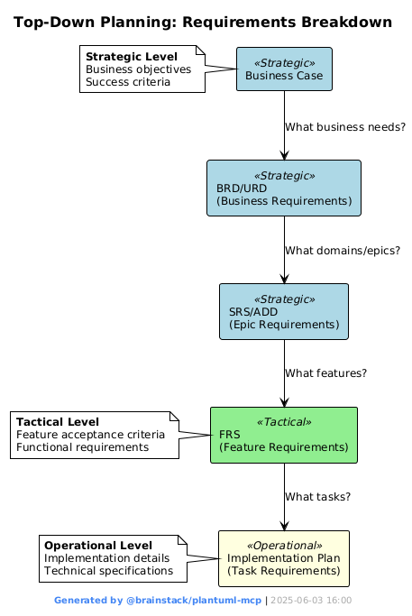
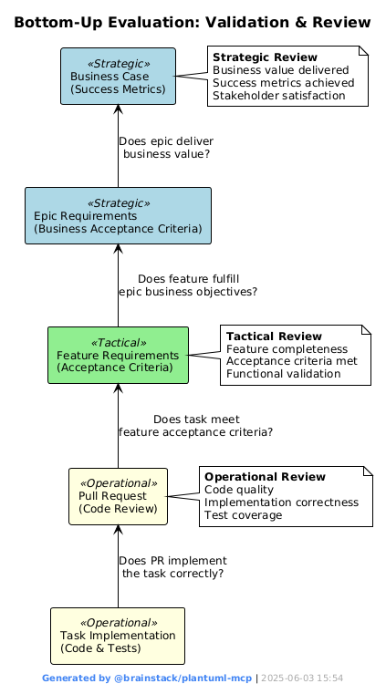

# Software Development Lifecycle – Roles, Documents, and Flow

## 🔷 1. Strategic Level – Vision, Architecture and Requirements (Horizontal)

1.1. Vision
### 🧑 Human
- **Activity**: 
  - Open Discussion
- **Deliverable**: 
  - Business Case
- **Human in the Loop**:
  - Approval required for all deliverables to proceed to the next phase

1.2. Requirements
### 🧾 AI - Business Analyst (BA)
- **Input**: Business Case
- **Activity**: 
  - Open Discussion
- **Deliverables**:
  - BRD (Business Requirements Document)
  - URD (User Requirements Document)
-**Human in the Loop**:
  - Approval required for all deliverables to proceed to the next phase

1.3. Architecture
### 🏗️ AI - Architect
- **Input**: BRD + URD
- **Activity**: 
  - Open Discussion
- **Deliverables**:
  - System Requirement Specification (SRS)   ---> Epics (Domain)
  - Architectural Design Document (ADD)
  - Best Practices
  - Design Patterns
-**Human in the Loop**:
  - Approval required for all deliverables to proceed to the next phase

### 📌 AI - Project Manager (Strategic Role)
- Adds EPICs into the project system (e.g., GitHub Project)
- Maintains BRD/URD ↔ EPIC linkage
- Aligns milestones with business objectives
-**Human in the Loop**:
  - Approval required for all deliverables to proceed to the next phase
---

## 🔷 2. Tactical Level – System Requirements and Feature Design  (Vertical)

2.1. Functional Requirements
### 🧠 AI - Functional Analyst (FA)
- **Input**: SRS, ADD, EPICs
- **Activity**: 
  - Open Discussion
- **Deliverables**:
  - Functional Requirements Specification (FRS) ----->  Features
-**Human in the Loop**:
  - Approval required for all deliverables to proceed to the next phase

2.2. Implementation Plan
### 🧑‍💻 AI - Lead Developer
- **Input**: Functional Requirements Specification (FRS)
- **Activity**: 
  - Open Discussion
- **Deliverables**:
  - Implementation Plan            ---> Tasks
-**Human in the Loop**:
  - Approval required for all deliverables to proceed to the next phase

### 📌 AI - Project Manager (Tactical Role)
- Maps: Task → Feature → EPIC
- Updates WBS, schedules, and project timeline
- Maintains complete traceability
-**Human in the Loop**:
  - Approval required for all deliverables to proceed to the next phase
---

## 🔷 3. Operational Level – Implementation and QA  (Vertical)

3.1. Implementation
### 🧑‍🔧 AI - Developers
- **Input**: Assigned Tasks
- **Output**: Code, Unit Tests, Feature Commits

3.2. Quality Assurance
### 🧪 AI - QA / Peer Reviewer
- **Input**: Completed Tasks
- **Output**:
  - PR Review
  - Code Quality Report
  - Acceptance Validation
  - Bug Reports
  - Request for Changes
-**Human in the Loop**:
  - Approval required to merge

### 📌 AI - Project Manager (Operational Role)
- Assigns Tasks, Monitors Progress
- Validates Feature and Epic completion
- Confirms requirement fulfillment from BRD/URD
-**Human in the Loop**:
  - Approval required for all deliverables to proceed to the next phase
---

## 🔁 Feedback Loop

1. Tasks complete → reviewed by QA/Peer
2. Lead Dev checks Feature status
3. PM rolls up Feature → EPIC → BRD/URD
4. If needed, FA/BA refines or closes the requirement

---

## ✅ Traceability Matrix

| Level       | Artifact     |    WBS      | Traceability                       |
|-------------|--------------|-------------|------------------------------------|
| Strategic   | BRD/URD      |             | Business Case                      |
| Strategic   | SRS/ADD      | Epic        | BRD/URD                            |
| Tactical    | FRS          | Feature     | Epic                               |
| Operational | Code         | Task        | Feature                            |
| Operational | Branch       | PR          | Task                               |

